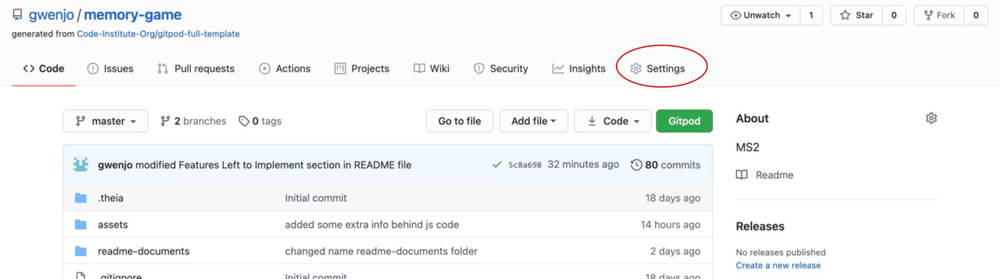
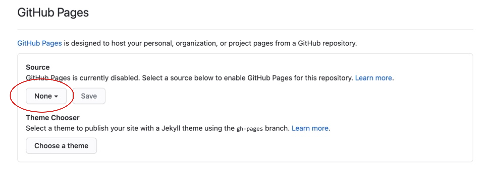
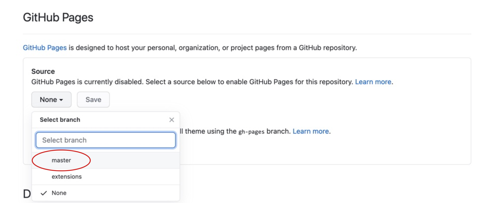
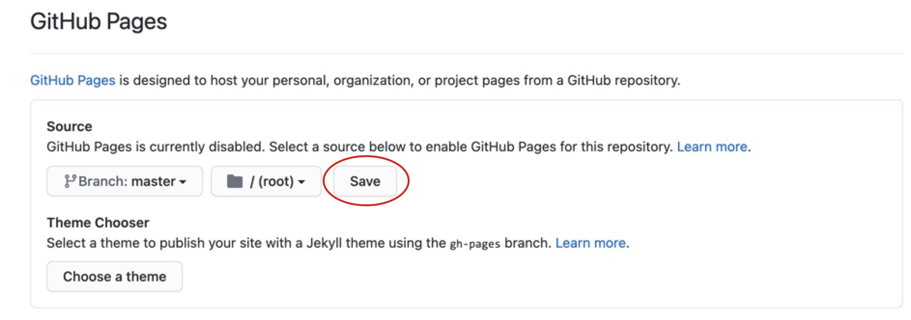
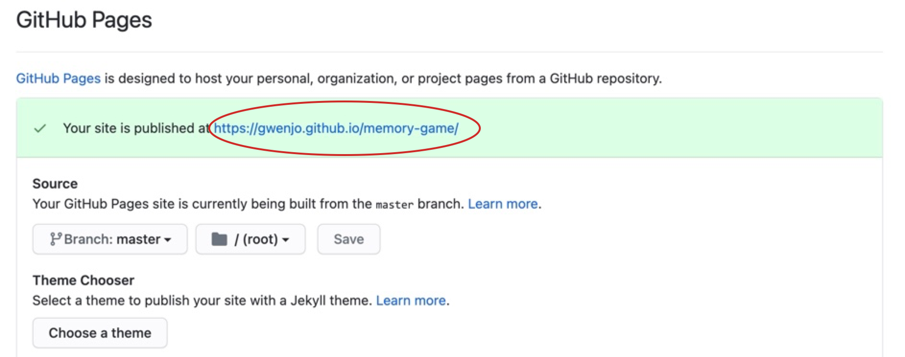

python3 -m http.server

## Two Pairs of Animals

---
This is a simple memory game; in this memory game the goal is to make as many pairs of cards as possible by turning over cards with the same picture.

To make the game more difficult you can choose a different level. You can choose from the following levels:
*   Easy    - 2x4
*   Med     - 3x4
*   Hard    - 4x4

The images I use are of different animals.

Instructions of the game:
You can start by turning the cards over. 
Remember the locations of the cards and make pairs of 2 of the same cards
You can increase the number of cards and the difficulty in the top left corner.                
By choosing EASY, MED and HARD. 
Good Luck!

[live site Memory](https://gwenjo.github.io/memory-game/) 

## User Experience (UX)
---

**User Story**

User’s goal:
* As a user, I want to play an easy and simple game 
* As a user, I want an easy navigate website
* As a user, I want to have different levels to better my skills
* As a user, I want to see a timer on the page, so I can see how much time I have been playing.

Site owner’s Goal:
* As the site owner, I want the user to have an easily accessible site.
* As the site owner, I want the user to have fun with this game

**Strategy**

I wanted to make a simple and above all easy game.
You can play it at home but also when you are on the road. The game is fun for everyone whether they are young or old.

**Scope**

The goal for me was that I have a user-friendly, simple and gentle on the eyes game. With simple colors such as black, gray and white.

**Structure**

The structure of this game is divided over three pages, on the homepage, where the game starts right with the level of EASY.
On all pages, at the top left corner you can find the different levels that can be played. Consisting of EASY-MED and -HARD.
You will also find a pop-up button on each page with instructions of the game. Next to this button is the Reset button. This allows you to shuffle the cards again and start a new game.

**Skeleton**

For the user stories I used [Balsamiq](https://balsamiq.com/) to create a nice and simple layout for the desktop and mobile screen.
Links to the wireframes can be found here:

*   [Desktop wireframe](readme-documents/wireframe-desktop.png)
*   [Tablet wireframe](readme-documents/wireframe-tablet.png)
*   [Mobile wireframe](readme-documents/wireframe-mobile.png)

**Surface**

For the images I used random animal pictures made by different photographers.

## Features

###### Navigationbar:
The navigation bar used here is about choosing different levels in the game. You can choose from EASY, MED, HARD.

###### Header:
All pages contain an instruction button to explain the game and a reset button to restart the game.

###### Footer:
In the footer you will find my initials and this year 2021

###### Home/ EASY- Page:
For the EASY page, the rows of the deck consist of 2 x 4 cards

###### MED-Page:
For the MED page, the rows of the deck consist of 3 x 4 cards

###### Hard-Page:
For the HARD page, the rows of the deck consist of 4 x 4 cards

#### Features Left to Implement

Due to lack of time, I didn't get around to adding the following features to this game. But I hope to implement the following points in the near future.

*   Submitting a name: This way you can add your name to the game and compete with your friends.
*   Score Board: So, users can see where they are ranked when they play against each other and for the possibility to see their score.
*   Even more difficult levels to the game to challenge yourself or your friend.

## Technologies Used
---
* HTML5 – I used HTML to create the layout.
* CSS3 – I used CSS to style the layout.
* JavaScript - I have used JavaScript to rotate the cards in the deck and run a timer.
* Github – to create a repository.
* Gitpod – for working in my repository.
* Bootstrap – I have used bootstrap for my popup modal.

### Tools used
---

**[Balsamiq](https://balsamiq.com/)**
-   Before I started the website, I used the Balsamiq software to set up my wireframe.  

**[Google Fonts](https://fonts.google.com/)**
-   I've used Google Fonts to select the font for my website.

**[Pexels](https://pexels.com/)**
-   The pictures of the different animals were taken by several photographers who posted photos on pexels.com. All names of the photographers are listed in the media section below this page.

**[Resize It]( https://apps.apple.com/us/app/resize-it-image-resize/id844716779)**
- I used an app on my phone to easily crop the photos to the correct size.

**[Adobe Color](https://color.adobe.com/nl/create/color-wheel)**
-  For the color selection I have used adobe color. [Click here](readme-documents/adobe-color.jpg) to see the color pallet.

**[W3School](https://www.w3schools.com/)**
-	For the navbar I used W3schools.

**[Bootstrap](https://getbootstrap.com/)**
-	For the popup modal I used Bootstrap.

**[Css Beautifier](https://www.freeformatter.com/css-beautifier.html)**
-   I used this online tool for formatting my CSS code.

**[Am I Responsive Design](http://ami.responsivedesign.is)**
-   For the mockup in the beginning of my readme file I used Am I Responsive Design.

**[W3C HTML Validator](https://validator.w3.org/)**
-   I used this tool to validate my HTML code.

**[W3C CSS Validator](http://jigsaw.w3.org/css-validator/)**
-    I used this tool to validate my CSS code.

**[Dillinger](https://dillinger.io/)**
-   I used dillenger to make my README file more organized.

**[Wave Webaim](https://wave.webaim.org/)**
For the correct contrast of my website I used webaim to check the color.

### Typography

For the typography I have used the Yusei Magic font with a backup font of Sans-serif. It is a nice and easy to read font. The font is also easy to read on smaller devices.

### Color

## Testing
---
#### W3C URL Validator

#### W3C HTML Validator

#### W3C CSS Validator

#### Lighthouse

## Deployment
---
For the deployment of the Memory Game, I used Github pages. Follow the next steps to my URL:

1.  Log in to my GitHub account and find my repository (https://gwenjo.github.io/memory-game/), open the github page.
2.  Click on Settings and scroll down till you find GitHub Pages (see photo’s below)

3.  Select ‘None’ in the dropdown

4.  Then select ‘master’ and “Save

5.  Now select ‘Branch: Master

6.  In the green bar you will find the URL: https://gwenjo.github.io/memory-game//

For the live version of the Memory Game! [Click here](https://gwenjo.github.io/memory-game/)

U can find information about cloning or downloading a repository [here](https://docs.github.com/en/free-pro-team@latest/github/creating-cloning-and-archiving-repositories/cloning-a-repository).

## Credits
---

### Content

### Media
•   The photographs I used for this memory game were obtained from [Pexels](https://www.pexels.com/) I’ve used photos from different photographers such as;

Front Face cards
-   Ethan Brooke (koala.jpg)
-   Elianne Dipp (whale.jpg)
-   Laura the Explaura (panda.jpg)
-   Lois (reindeer.jpg)
-   Josiah Farrow (alpaca.jpg)

-   Taryn Elliott (penguin.jpg)
-   Tomáš Malík (fox.jpg)
-   Ali Sufian Saghar (leopard.jpg)
-   Magda Ehlers (giraffe.jpg)
-   James Frid (parrot.jpg)

Back Face cards
-   Takeshi Arai (feather.jpg)

### Acknowledgements

- 
