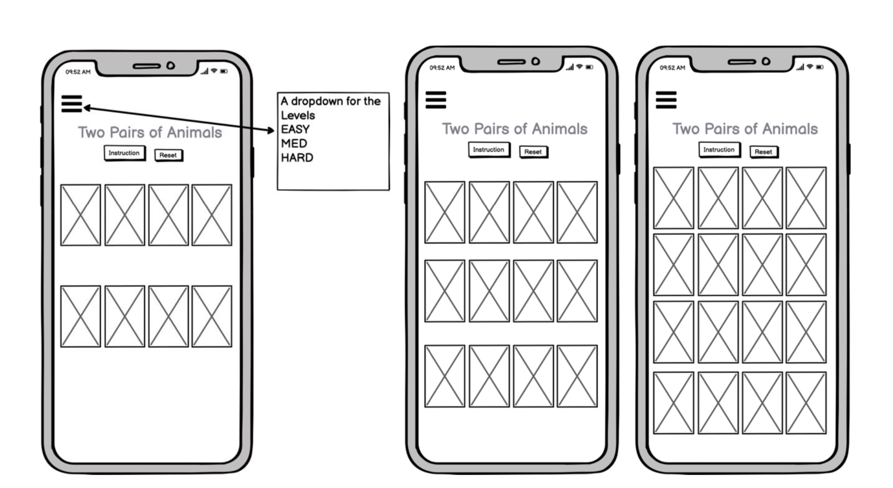

## Two Pairs of Animals

python3 -m http.server

---
This is a simple memory game; in this memory game the goal is to make as many pairs of cards by turning over cards with the same picture.

To make the game more difficult you can choose a different level. You can choose from the following levels:
*   Easy    - 2 x 4
*   Med     - 3 x 4
*   Hard    - 4 x 4

The images I use are of different animals.

Instructions of the game:
Remember the locations of the cards and make pairs of 2 of the same cards
You can increase the number of cards and the difficulty in the top left corner. By choosing the levels EASY, MED and HARD. When u want to start over, press the Reset button. You can start by turning the cards over. Good Luck!

[live site Two Pairs of Animals](https://gwenjo.github.io/memory-game/) 

## User Experience (UX)
---

**User Story:**
* As a user, I want to play an easy and simple game when I have a break from work/ school.
* As a user, I want an easy navigation website so that I can play a game quickly.
* As a user, I want to have different levels in the game so that I can improve my memory skills.
* As a user, when the cards are turned over, I want to see if I have the correct card.

**Site owner’s Goal:**
* As the site owner, I want the user to have an easily accessible site.
* As the site owner, I want the user to have fun with this game.

**Strategy**
The goal is to build a simple and easy to navigate game with a welcome / instruction message with different game levels.
The game is fun for everyone whether they are young or old.

**Scope**
The goal for me was that I have a user-friendly, simple and gentle on the eyes game. With simple colors such as black, gray and white.

**Structure**
The structure of this game is divided over three pages, on the homepage, where the game starts right with the level of EASY.
On all pages, at the top left corner you can find the different levels that can be played. Consisting of EASY-MED and -HARD.
Everytime when u reset the game there will be a instruction message of the game.
The reset button allows you to shuffle the cards again and start a new game.

**Skeleton**
For the user stories I used [Balsamiq](https://balsamiq.com/) to create a nice and simple layout for the desktop and mobile screen.
Links to the wireframes can be found here:

Desktop Wireframes  

Desktop Wireframe, for bigger image [Click here](readme-documents/wireframe-desktop.png)

Tablet Wireframe  

Tablet Wireframe, for bigger image [Click here](readme-documents/wireframe-tablet.png)

Mobile Wireframe  

Mobile Wireframe, for bigger image [Click here](readme-documents/wireframe-mobile.png)

**Surface**
The photographs for this memory game are from [Pexels](https://www.pexels.com/)and made by different photographers.

## Features

###### When opening the page:
When opening the page you will find an instruction message of the game. When closing  the window you can immediately start the game.

###### Navigationbar:
The navigation bar used here is to choose different levels in the game. You can choose from EASY, MED, HARD.

###### Header:
All pages contain a reset button to restart the game.

###### Footer:
In the footer you will find my initials and this year 2021

###### Home/ EASY- Page:
For the EASY page, the rows of the deck consist of 2 x 4 cards

###### MED-Page:
For the MED page, the rows of the deck consist of 3 x 4 cards

###### Hard-Page:
For the HARD page, the rows of the deck consist of 4 x 4 cards

#### Features Left to Implement
Due to lack of time, I didn't get around to adding the following features to this game. But I hope to implement the following points in the near future.

*   Submitting a name: This way you can add your name to the game and compete with your friends.
*   Score Board: So, users can see where they are ranked when they play against each other and for the possibility to see their score.
*   Even more difficult levels to the game to challenge yourself or your friend.

## Technologies Used
---
* HTML5 – I used HTML to create the layout.
* CSS3 – I used CSS to style the layout.
* JavaScript - I have used JavaScript to rotate the cards in the deck and run a timer.
* Github – to create a repository.
* Gitpod – for working in my repository.
* Bootstrap – I have used bootstrap for my popup modal.

### Tools used
---

**[Balsamiq](https://balsamiq.com/)**
-   Before I started the website, I used the Balsamiq software to set up my wireframe.  

**[Google Fonts](https://fonts.google.com/)**
-   I've used Google Fonts to select the font for my website.

**[Pexels](https://pexels.com/)**
-   The pictures of the different animals were taken by several photographers who posted photos on pexels.com. All names of the photographers are listed in the media section below this page.

**[Resize It]( https://apps.apple.com/us/app/resize-it-image-resize/id844716779)**
- I used an app on my phone to easily crop the photos to the correct size.

**[Adobe Color](https://color.adobe.com/nl/create/color-wheel)**
-  For the color selection I have used adobe color. [Click here](readme-documents/adobe-color.jpg) to see the color pallet.

**[W3School](https://www.w3schools.com/)**
-	For the navbar I used W3schools.

**[Bootstrap](https://getbootstrap.com/)**
-	For the popup modal I used Bootstrap.

**[Css Beautifier](https://www.freeformatter.com/css-beautifier.html)**
-   I used this online tool for formatting my CSS code.

**[Am I Responsive Design](http://ami.responsivedesign.is)**
-   For the mockup in the beginning of my readme file I used Am I Responsive Design.

**[W3C HTML Validator](https://validator.w3.org/)**
-   I used this tool to validate my HTML code.

**[W3C CSS Validator](http://jigsaw.w3.org/css-validator/)**
-    I used this tool to validate my CSS code.

**[Dillinger](https://dillinger.io/)**
-   I used dillenger to make my README file more organized.

**[Wave Webaim](https://wave.webaim.org/)**
For the correct contrast of my website I used webaim to check the color.

### Typography
For the typography I have used the Yusei Magic font with a backup font of Sans-serif. It is a nice and easy to read font. The font is also easy to read on smaller devices.

### Color
I used the Adobe color scheme to choose the colors for my game.

For this game and to help you concentrate well, I have chosen colors that are gentle on the eyes.

Body text: black

Background: #a9a9a9

## Testing
---
#### W3C URL / HTML Validator
When I ran the URL site through the validator, it revealed 1 error. I also ran the html pages individually through the W3C HTML validator and they all revealed 1 error.

I changed "section class" to "main class". This is because I didn't need an h2-h6 element. When I corrected the files, I ran it through the validator again and it came back with no errors.

#### W3C CSS Validator
I ran the style.css page individually through the W3C CSS validator:
One error was found. Somewhere in the page I had an extra closing tab. 

This has been corrected and passed through the W3C CSS validator again. The page passed without errors or warnings.

#### Lighthouse

## Deployment
---
For the deployment of the Memory Game, I used Github pages. Follow the next steps to my URL:

1.  Log in to my GitHub account and find my repository (https://gwenjo.github.io/memory-game/), open the github page.
2.  Click on Settings and scroll down till you find GitHub Pages (see photo’s below)

3.  Select ‘None’ in the dropdown

4.  Then select ‘master’ and “Save

5.  Now select ‘Branch: Master

6.  In the green bar you will find the URL: https://gwenjo.github.io/memory-game//

For the live version of the Memory Game! [Click here](https://gwenjo.github.io/memory-game/)

U can find information about cloning or downloading a repository [here](https://docs.github.com/en/free-pro-team@latest/github/creating-cloning-and-archiving-repositories/cloning-a-repository).

## Credits
---

### Content

-	The instructions were written by me (Gwendolyn Jo).
-   This navbar element is based on code components of from [Bootstrap](https://getbootstrap.com/docs/4.5/components/navbar/).
-   For the beginning instruction message, “window closing” I used [W3schools](https://www.w3schools.com/jsref/met_win_close.asp). 
-   For the card setup I used code and adapted it for this game from [Marina Ferrera](https://marina-ferreira.github.io/tutorials/js/memory-game/). 
-   For the background change, colors (red / green) I used [Stackoverflow](https://stackoverflow.com/questions/32206223/onclick-change-background-color-with-javascript).
-   For several JavaScript parts I used code from [Tania Rascia](https://www.taniarascia.com/how-to-create-a-memory-game-super-mario-with-plain-javascript/) and [Marina Ferrera](https://marina-ferreira.github.io/tutorials/js/memory-game/).

### Media
The photographs I used for this memory game were obtained from [Pexels](https://www.pexels.com/) I’ve used photos from different photographers such as;

Front cards
-   Ethan Brooke (koala.jpg)
-   Elianne Dipp (whale.jpg)
-   Laura the Explaura (panda.jpg)
-   Lois (reindeer.jpg)
-   Josiah Farrow (alpaca.jpg)

-   Taryn Elliott (penguin.jpg)
-   Tomáš Malík (fox.jpg)
-   Ali Sufian Saghar (leopard.jpg)
-   Magda Ehlers (giraffe.jpg)
-   James Frid (parrot.jpg)

Back cards
-   Takeshi Arai (feather.jpg)

### Acknowledgements
- I want to thank my mentor Sinead O'Brien for always giving me good advice. I am so sad that you stopping mentoring for a while.
- Special thanks to the Slack community. If I had any questions, I could always trust that my questions were answered.
- I want to thank my friends and family who have viewed my website multiple times and have given me good criticism on my game.